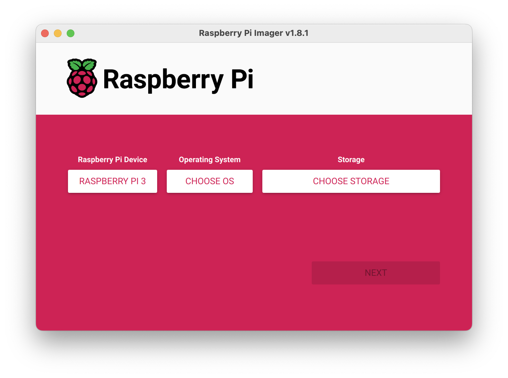
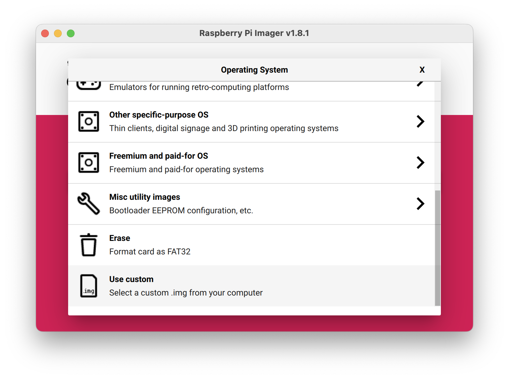
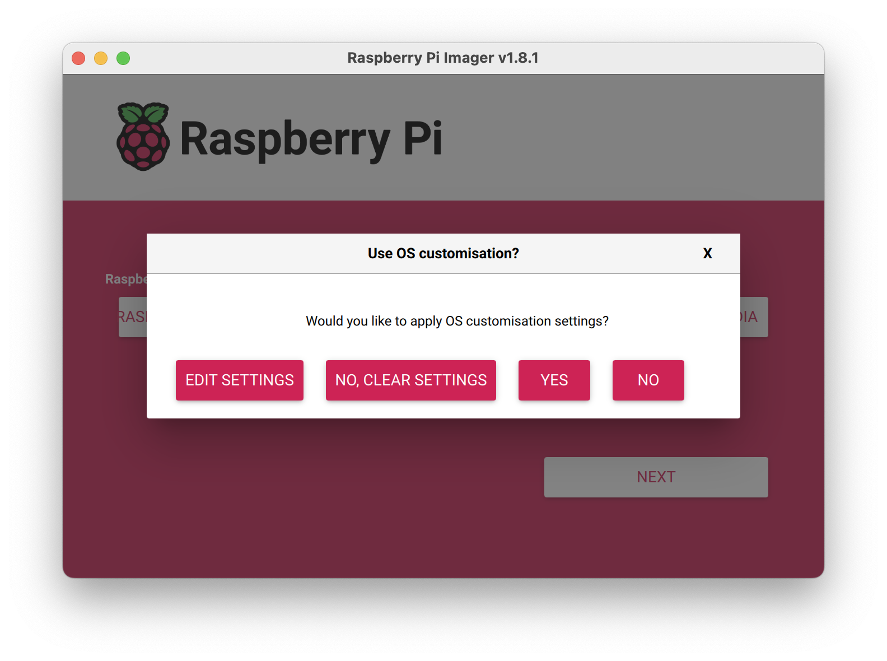
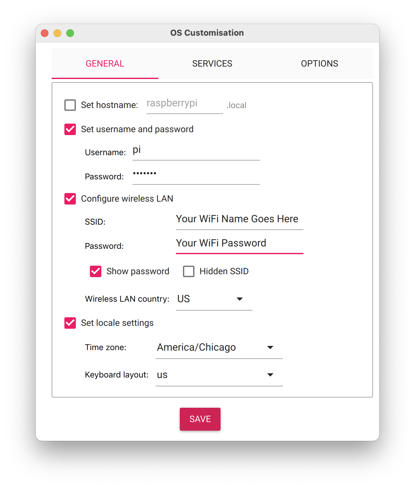

# What you need to get started
- Raspberry Pi (version 3 or 4) + power + MicroSD card
- [Raspberry Pi Imager](https://github.com/raspberrypi/rpi-imager/releases)
- [RNBO Image File](https://rnbo.cycling74.com/resources) - this is a RNBO-ready version of Debian 11 that will run on the Raspberry Pi

# Flashing the OS
Insert your MicroSD card into your computer and open the [Raspberry Pi Imager](https://github.com/raspberrypi/rpi-imager/releases).
Under "Raspberry Pi Device" select your Raspberry Pi version.

Click "Choose OS," scroll to the bottom and click "Use custom," and then select the [RNBO Image File](https://rnbo.cycling74.com/resources).

Click "Choose Storage" and select your MicroSD card.
Click "Next."
Choose "Edit Settings." (If MacOS asks to pre-fill your Wifi password, you can either choose to do that or manually enter the WiFi information yourself.)

Under the General tab, use these settings:

It is important to not change the hostname. It is also important to set the username to "pi." Choose a password that you'll remember. If you opted to not have MacOS pre-fill your WiFi name/password, manually enter that here. Finally, set your locale to optimize the WiFi communication.
Go to the "Services" tab. Enable SSH with password authentication. Click "Save."

