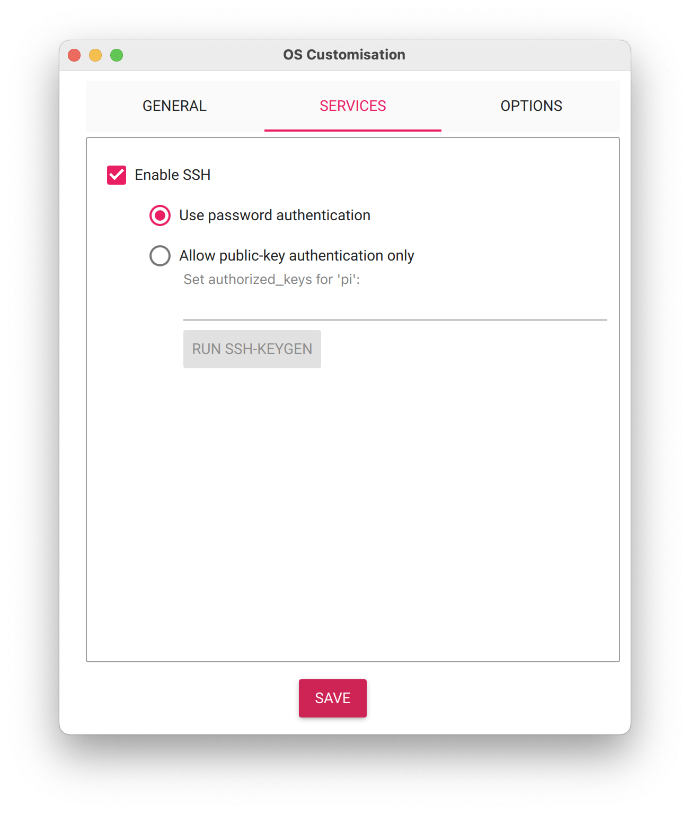
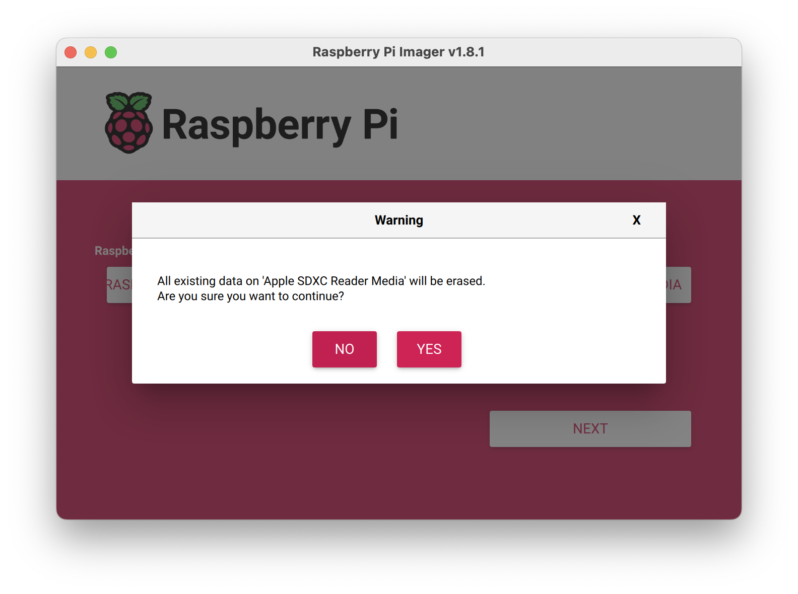
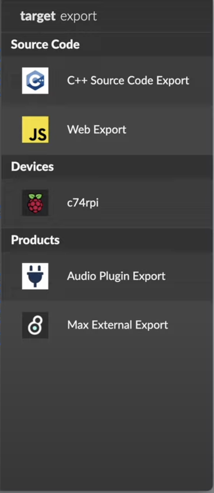
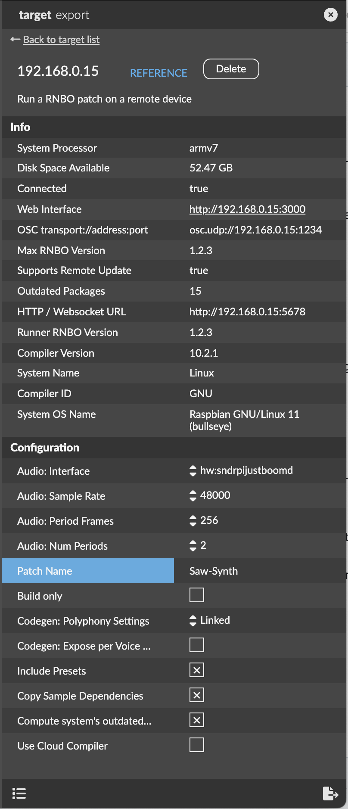

# What you need to get started
- Raspberry Pi (version 3 or 4) + power + MicroSD card
- Class-compliant audio interface 
- [Raspberry Pi Imager](https://github.com/raspberrypi/rpi-imager/releases)
- [RNBO Image File](https://rnbo.cycling74.com/resources) - get the latest version, this is a RNBO-ready version of Debian 11 that will run on the Raspberry Pi
- [Max/RNBO](https://rnbo.cycling74.com/) - make sure you have the latest version

# Flashing the OS
Insert your MicroSD card into your computer and open the [Raspberry Pi Imager](https://github.com/raspberrypi/rpi-imager/releases).

Under "Raspberry Pi Device" select your Raspberry Pi version.

Click "Choose OS," scroll to the bottom and click "Use custom," and then select the [RNBO Image File](https://rnbo.cycling74.com/resources).

Click "Choose Storage" and select your MicroSD card.

Click "Next."

Choose "Edit Settings." (If MacOS asks to pre-fill your Wifi password, you can either choose to do that or manually enter the WiFi information yourself.)

Under the General tab, use these settings:

It is important to not change the hostname. It is also important to set the username to "pi." Choose a password that you'll remember. If you opted to not have MacOS pre-fill your WiFi name/password, manually enter that here. Finally, set your locale to optimize the WiFi communication.

Go to the "Services" tab. Enable SSH with password authentication. Click "Save."

Back at the "Use OS Customisation" menu, choose "Yes."

You'll get a warning that the MicroSD card will be completely erased when the new image is flashed. Click "Yes" to continue.

The flashing process will begin and take 5-10 minutes to write and verify. When it is complete, you'll get a pop-up notice that the drive is flashed and ready to use.

Eject the MicroSD from the computer and insert it into the Raspberry Pi.

# Setting up and booting the Raspberry Pi
Before connecting power to the Raspberry Pi, connect your class-compliant audio interface via USB. Alternatively, you can use a [Raspberry Pi audio hat](https://www.google.com/search?q=raspberry+pi+audio+hat).

Connect power to the Raspberry Pi. The red LED indicates power. The flash green LED indicates that the computer is reading from the MicroSD.

It might take 2-3 minutes for the first booting sequence to complete.

Make sure your computer is connected to the same WiFi as the one you setup in the Raspberry Pi Imager.

Open up a RNBO project and open the Export Sidebar. If everything worked, you should see your Raspberry Pi as an option under "Devices."

(If you don't see your Raspberry Pi, there's a couple reasons what might be happening. In order to solve, see the SSH section below.)

Click on your device to open the target export settings menu. You may see a prompt at the top of the screen to update your RNBO version; if so, do that.

The most crucial items in the settings are:
- Audio interface: set this to your connected audio interface, either over USB or attached as a hat
- Audio interface settings (ie. Sample Rate, Frames, Periods): adjust these settings to optimize performance as needed
- Patch name: give your code a unique name that you can refer to later

When set, click the bottom-right icon to export and compile on the Raspberry Pi.

